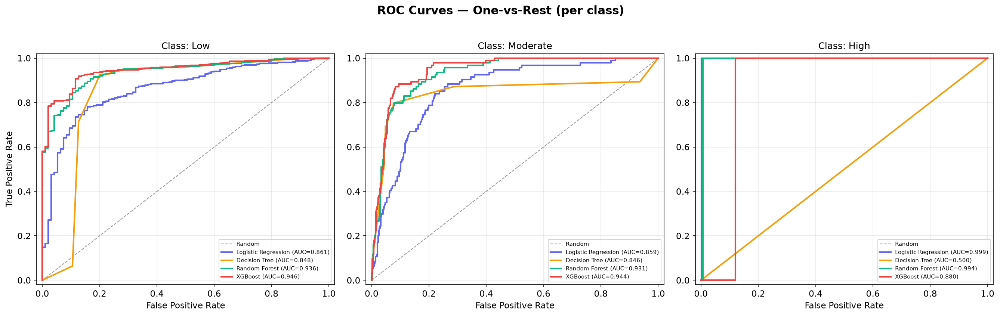
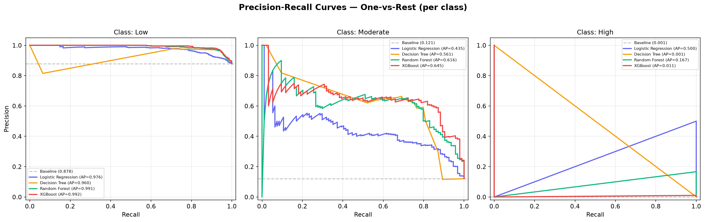
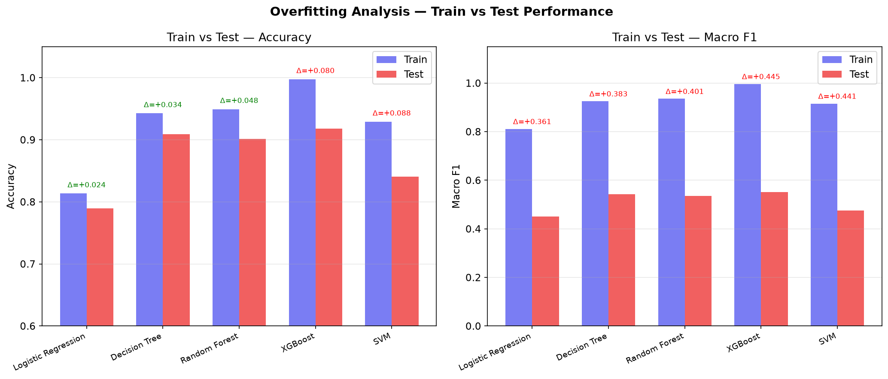
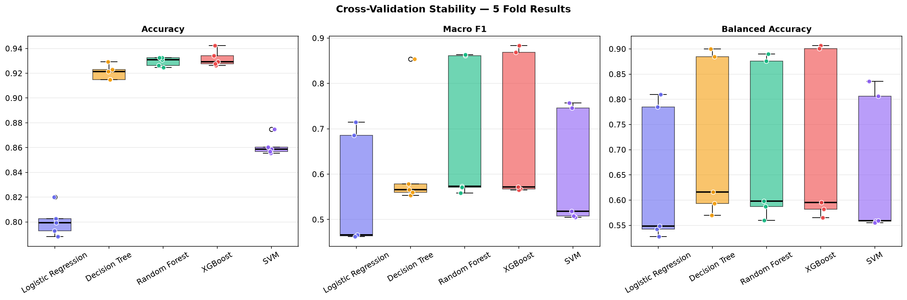
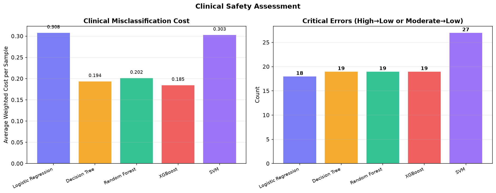
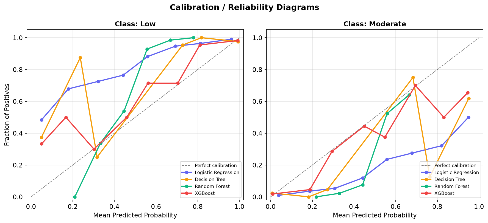
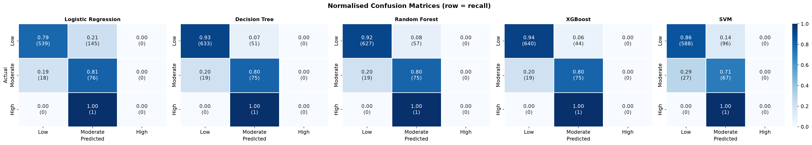
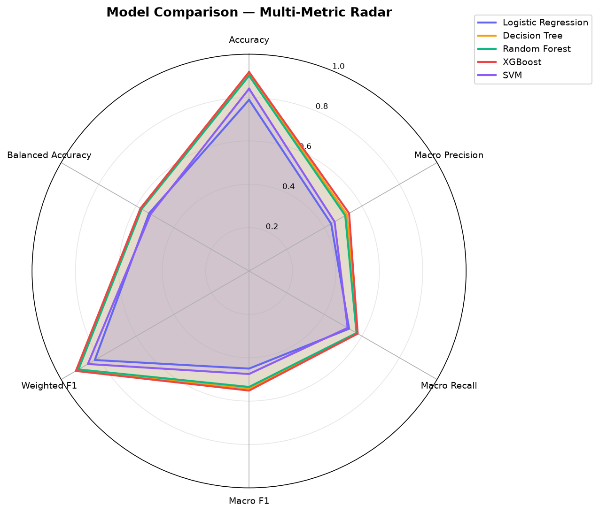

# Comprehensive Model Evaluation Report
**Oncology Toxicity Risk Prediction**  
Generated: 2026-09-07 09:25:03  
Evaluation Engineer — Automated Assessment

---

## Executive Summary

This report presents a comprehensive evaluation of 5 machine learning models 
trained for **multiclass toxicity risk prediction** (Low / Moderate / High) 
in oncology patients.

> [!IMPORTANT]
> **Best Model: XGBoost** — Test Accuracy: 0.9178, Test Macro F1: 0.5513

> [!WARNING]
> The **High** toxicity class has only **4 total samples** (1 in test). All High-class metrics are statistically unreliable. This model should NOT be used for High-risk patient identification without substantially more High-class data.

## Dataset Summary

| Property | Value |
|---|---|
| Total Samples | 3,893 |
| Train/Test Split | 80/20 (Patient-level, GroupShuffleSplit) |
| Test Samples | 779 |
| Low (test) | 684 |
| Moderate (test) | 94 |
| High (test) | 1 |
| Patient Overlap | 0 (CLEAN) |
| Features Used | 26 |
| Leakage Status | CLEAN ✓ |

## Test Performance Comparison

| Model | Accuracy | Macro Prec | Macro Recall | Macro F1 | Weighted F1 | Balanced Acc |
|---|---|---|---|---|---|---|
| Logistic Regression | 0.7895 | 0.4367 | 0.5322 | 0.4499 | 0.8208 | 0.5322 |
| Decision Tree | 0.9089 | 0.5205 | 0.5744 | 0.5421 | 0.9139 | 0.5744 |
| Random Forest | 0.9012 | 0.5115 | 0.5715 | 0.5346 | 0.9076 | 0.5715 |
| XGBoost ★ | 0.9178 | 0.5321 | 0.5778 | 0.5513 | 0.9214 | 0.5778 |
| SVM | 0.8408 | 0.4549 | 0.5241 | 0.4749 | 0.8576 | 0.5241 |

## Per-Class Analysis

### Class: Low

| Model | Precision | Recall | F1 | Support |
|---|---|---|---|---|
| Logistic Regression | 0.9677 | 0.7880 | 0.8687 | 684 |
| Decision Tree | 0.9709 | 0.9254 | 0.9476 | 684 |
| Random Forest | 0.9706 | 0.9167 | 0.9429 | 684 |
| XGBoost | 0.9712 | 0.9357 | 0.9531 | 684 |
| SVM | 0.9561 | 0.8596 | 0.9053 | 684 |

### Class: Moderate

| Model | Precision | Recall | F1 | Support |
|---|---|---|---|---|
| Logistic Regression | 0.3423 | 0.8085 | 0.4810 | 94 |
| Decision Tree | 0.5906 | 0.7979 | 0.6787 | 94 |
| Random Forest | 0.5639 | 0.7979 | 0.6608 | 94 |
| XGBoost | 0.6250 | 0.7979 | 0.7009 | 94 |
| SVM | 0.4085 | 0.7128 | 0.5194 | 94 |

### Class: High

| Model | Precision | Recall | F1 | Support |
|---|---|---|---|---|
| Logistic Regression | 0.0000 | 0.0000 | 0.0000 | 1 |
| Decision Tree | 0.0000 | 0.0000 | 0.0000 | 1 |
| Random Forest | 0.0000 | 0.0000 | 0.0000 | 1 |
| XGBoost | 0.0000 | 0.0000 | 0.0000 | 1 |
| SVM | 0.0000 | 0.0000 | 0.0000 | 1 |

## ROC / AUC Analysis

| Model | Low AUC | Moderate AUC | High AUC | Macro AUC |
|---|---|---|---|---|
| Logistic Regression | 0.8611 | 0.8586 | 0.9987 | 0.9061 |
| Decision Tree | 0.8484 | 0.8456 | 0.5 | 0.7313 |
| Random Forest | 0.9363 | 0.9313 | 0.9936 | 0.9537 |
| XGBoost | 0.9463 | 0.9438 | 0.8805 | 0.9235 |

## Precision-Recall Analysis

| Model | Low AP | Moderate AP | High AP | Macro AP |
|---|---|---|---|---|
| Logistic Regression | 0.976 | 0.4346 | 0.5 | 0.6369 |
| Decision Tree | 0.9602 | 0.5615 | 0.0013 | 0.5077 |
| Random Forest | 0.9906 | 0.616 | 0.1667 | 0.5911 |
| XGBoost | 0.9923 | 0.6448 | 0.0106 | 0.5492 |

## Overfitting Analysis

| Model | Train Acc | Test Acc | Gap | Train F1 | Test F1 | Gap | Status |
|---|---|---|---|---|---|---|---|
| Logistic Regression | 0.8134 | 0.7895 | +0.0239 | 0.8111 | 0.4499 | +0.3613 | ⚠ OVERFITTING |
| Decision Tree | 0.9425 | 0.9089 | +0.0337 | 0.9252 | 0.5421 | +0.3831 | ⚠ OVERFITTING |
| Random Forest | 0.9493 | 0.9012 | +0.0481 | 0.9352 | 0.5346 | +0.4007 | ⚠ OVERFITTING |
| XGBoost | 0.9974 | 0.9178 | +0.0796 | 0.9963 | 0.5513 | +0.4450 | ⚠ OVERFITTING |
| SVM | 0.9290 | 0.8408 | +0.0882 | 0.9154 | 0.4749 | +0.4405 | ⚠ OVERFITTING |

## Cross-Validation Stability

| Model | CV Macro F1 (mean ± std) | Range |
|---|---|---|
| Logistic Regression | 0.5584 ± 0.1160 | 0.4622 – 0.7145 |
| Decision Tree | 0.6221 ± 0.1160 | 0.5528 – 0.8535 |
| Random Forest | 0.6855 ± 0.1444 | 0.5586 – 0.8636 |
| XGBoost | 0.6912 ± 0.1508 | 0.5653 – 0.8831 |
| SVM | 0.6067 ± 0.1183 | 0.5050 – 0.7569 |

## Clinical Misclassification Cost

> [!CAUTION]
> Missing a **High-risk** patient (predicting Low) carries a cost weight 
> of **20×**, reflecting the severe clinical consequences of undetected toxicity.

| Model | Total Cost | Avg Cost/Sample | Critical Errors | Error Rate |
|---|---|---|---|---|
| Logistic Regression | 240 | 0.3081 | 18 | 0.2105 |
| Decision Tree | 151 | 0.1938 | 19 | 0.0911 |
| Random Forest | 157 | 0.2015 | 19 | 0.0988 |
| XGBoost | 144 | 0.1849 | 19 | 0.0822 |
| SVM | 236 | 0.3030 | 27 | 0.1592 |

## Calibration Analysis

| Model | ECE (Low) | ECE (Moderate) |
|---|---|---|
| Logistic Regression | 0.2012 | 0.2025 |
| Decision Tree | 0.0583 | 0.0589 |
| Random Forest | 0.1616 | 0.1947 |
| XGBoost | 0.0509 | 0.0518 |

## Visual Comparisons

### Normalised Confusion Matrices

### Multi-Metric Radar Chart

## Key Findings

1. **Best overall model**: XGBoost (Macro F1 = 0.5513, Accuracy = 0.9178)
2. **Lowest clinical cost**: XGBoost (avg cost/sample = 0.1849)
3. **Overfitting detected**: Logistic Regression, Decision Tree, Random Forest, XGBoost, SVM
4. **Most stable model**: Decision Tree (lowest CV Macro F1 std = 0.1160)
5. **Class imbalance**: High class has only 4 samples — 
   all High-class metrics are unreliable
6. **Leakage status**: CLEAN — no patient overlap, no target-derived features

## Recommendations

> [!NOTE]
> These recommendations are for improving the model pipeline, 
> not for clinical deployment.

1. **Collect more High-class samples** — 4 samples is insufficient for any reliable classification. Target at least 50–100 High-risk cases.
2. **Consider binary framing** — Merge Low+Moderate vs High, or Low vs Moderate+High for a more balanced and clinically useful split.
3. **Calibrate probabilities** — Use `CalibratedClassifierCV` (isotonic or Platt scaling) to improve probability estimates.
4. **Threshold tuning** — For clinical deployment, optimise the classification threshold on the Moderate class to balance sensitivity and specificity.
5. **External validation** — Test on an independent external cohort before considering any clinical use.
6. **SHAP analysis** — Use SHAP values for individual prediction explanations to build clinical trust.

---

> [!CAUTION]
> **DISCLAIMER**: This is an educational/research prototype for oncology 
> toxicity risk prediction. It is **NOT** clinically validated and must 
> **NOT** be used to independently make treatment decisions.